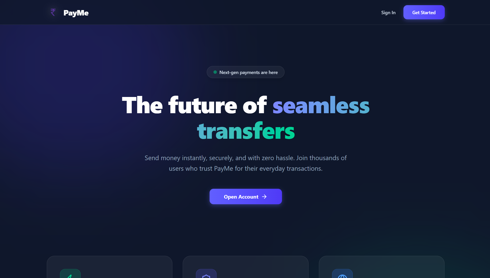
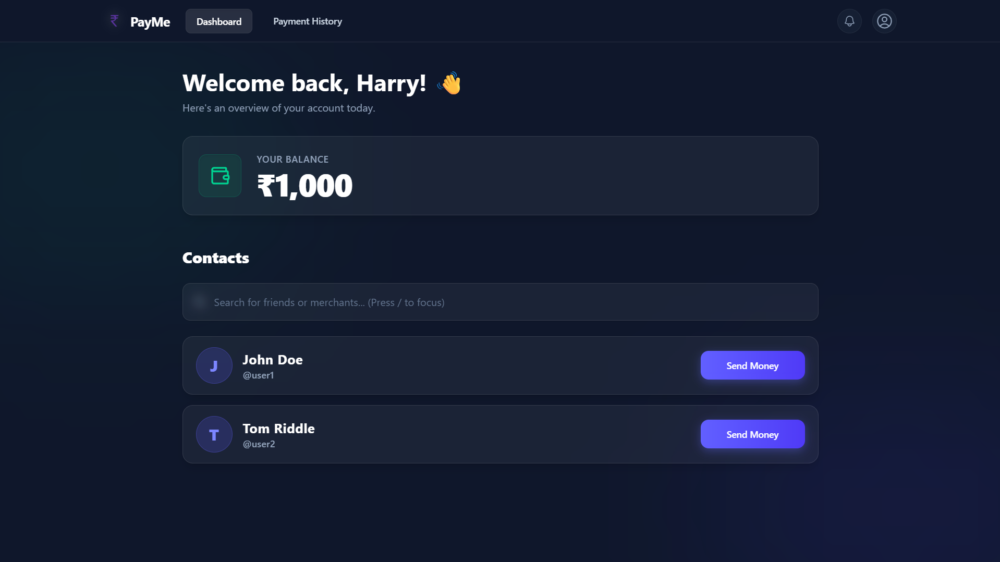
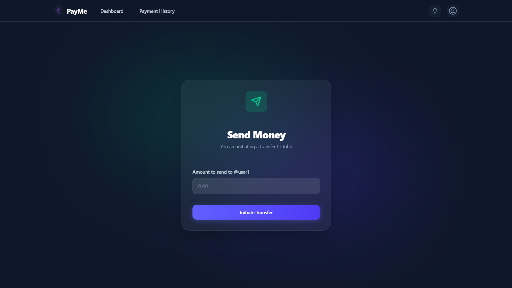
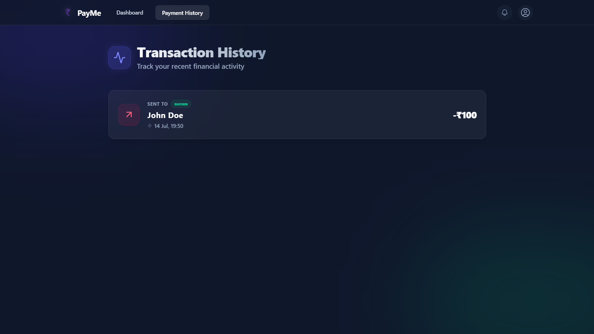

# PayMe

**PayMe** is a full-stack, lightweight payment application that allows users to instantly and securely transfer money to one another. Built on the modern MERN stack with a stunning **Dark Glassmorphism UI**, PayMe provides a premium, seamless user experience out of the box.

---

## Screenshots

<div align="center">
  
  <br/><br/>
  
  <br/><br/>
  
  <br/><br/>
  
</div>

---

## Features

- **Secure Authentication**: Robust JWT-based authentication with password hashing, Zod validation, and secure route protection.
- **Instant Transfers**: Transfer funds to other users instantly. Backed by **MongoDB Transactions**, ensuring ACID compliance and preventing race conditions or partial failures.
- **Premium UI/UX**: Completely designed with a modern, responsive Dark Glassmorphism aesthetic using Tailwind CSS and Headless UI.
- **Real-time Notifications**: Receive instant notification alerts whenever you receive a payment from another user.
- **Payment History**: Track all your past sent and received transactions in a beautifully formatted history view.
- **User Search**: Instantly search for other users on the platform to send money to.
- **Account Management**: Update your personal information and password securely.

---

## Technology Stack

### Frontend
- **React 18** (Vite)
- **Tailwind CSS** (for styling and glassmorphism effects)
- **Headless UI & Lucide-React** (for accessible interactive components and icons)
- **React Router DOM** (for client-side routing)
- **Axios** (for API calls)
- **Sonner** (for beautiful toast notifications)

### Backend
- **Node.js & Express.js**
- **MongoDB & Mongoose** (with Transaction Sessions)
- **JSON Web Tokens (JWT)** (for stateless authentication)
- **Zod** (for strict input validation)
- **Bcrypt** (for password hashing)

---

## Getting Started

Follow these instructions to get a copy of the project up and running on your local machine for development and testing purposes.

### Prerequisites

- [Node.js](https://nodejs.org/en/) (v16 or higher)
- [MongoDB](https://www.mongodb.com/) (Local installation or MongoDB Atlas cluster)

### 1. Clone the repository

```bash
git clone https://github.com/pranshu1411/PayMe.git
cd PayMe
```

### 2. Backend Setup

Open a terminal and navigate to the `backend` directory:

```bash
cd backend
npm install
```

Create a `.env` file in the root of the `backend` folder and add the following variables:

```env
PORT=3000
MONGO_URI=mongodb://localhost:27017/payment-app  # Replace with your MongoDB URI if using Atlas
JWT_SECRET=your_super_secret_jwt_key
```

Start the backend development server:

```bash
npm run dev
```
*The server will start on `http://localhost:3000`.*

### 3. Frontend Setup

Open a new terminal window and navigate to the `frontend` directory:

```bash
cd frontend
npm install
```

Start the Vite development server:

```bash
npm run dev
```
*The frontend will start on `http://localhost:5173`. Open this URL in your browser to view the app.*

---

## Project Structure

```
PayMe/
├── backend/                  # Express API Backend
│   ├── db/                   # Mongoose Schemas (User, Account, Transaction, Notification)
│   ├── middleware/           # JWT Auth middleware
│   ├── routes/               # API endpoint definitions
│   │   ├── index.js          # Main router
│   │   ├── user.js           # Auth & User management
│   │   ├── accounts.js       # Balances, Transfers, & History
│   │   └── notifications.js  # Notification fetching & marking as read
│   ├── utils/                # Password hashing and token generation
│   └── index.js              # Server entry point
│
└── frontend/                 # React (Vite) Frontend
    ├── src/
    │   ├── assets/           # Images and static files
    │   ├── components/       # Reusable UI components (Appbar, Buttons, Inputs, etc.)
    │   ├── pages/            # Application routes (Home, Signin, Dashboard, SendMoney, etc.)
    │   ├── App.jsx           # React Router setup
    │   └── main.jsx          # React DOM root
    ├── index.html            # Main HTML file
    ├── tailwind.config.js    # Tailwind configuration
    └── package.json          # Frontend dependencies
```

---

## API Endpoints

Here is a quick overview of the core API routes available:

### Auth & Users (`/api/user`)
- `POST /signup` - Register a new user
- `POST /signin` - Authenticate a user and return a JWT
- `PUT /update/personal` - Update user's personal details
- `PUT /update/password` - Update user's password
- `GET /allusers` - Search for users (supports query filters)

### Accounts & Transactions (`/api/account`)
- `GET /balance` - Get the current user's wallet balance
- `POST /transfer` - Transfer funds to another user (Database Transaction)
- `GET /history` - Get a detailed history of all transactions

### Notifications (`/api/notifications`)
- `GET /` - Fetch all notifications for the current user
- `PUT /read` - Mark all unread notifications as read

---

## Security Notes

- Passwords are securely hashed using `bcrypt` before being stored in the database.
- Money transfers utilize **MongoDB Transactions** (`session.startTransaction()`) to guarantee that both the sender's debit and the receiver's credit succeed together. If any failure occurs, the transaction is completely rolled back, ensuring funds are never lost in transit.
- All protected routes are secured using JWT tokens passed via the `Authorization: Bearer <token>` header.

---
*Built using the MERN stack.*
